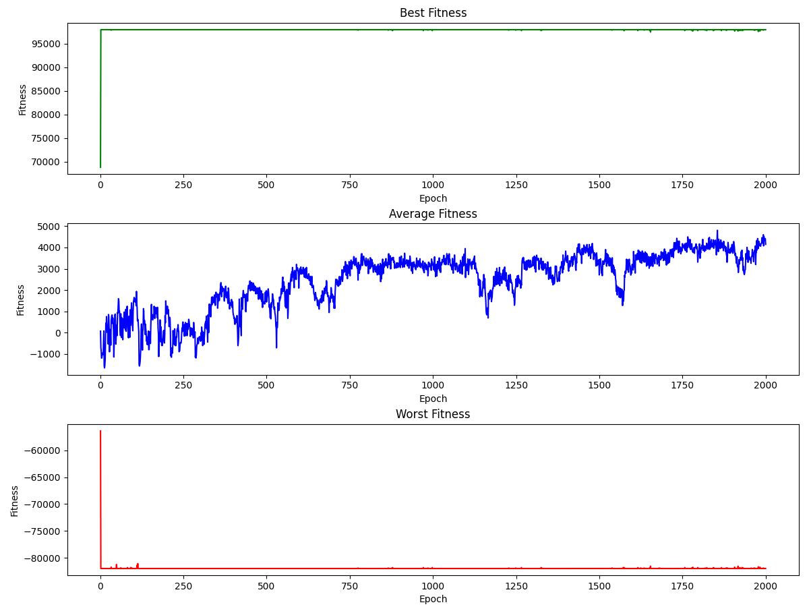
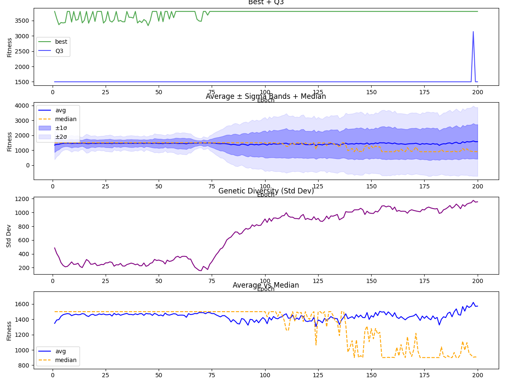
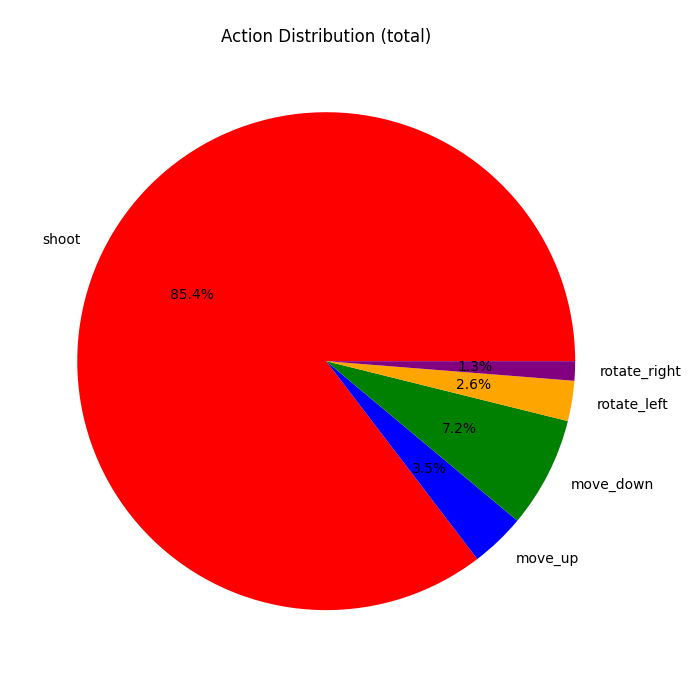
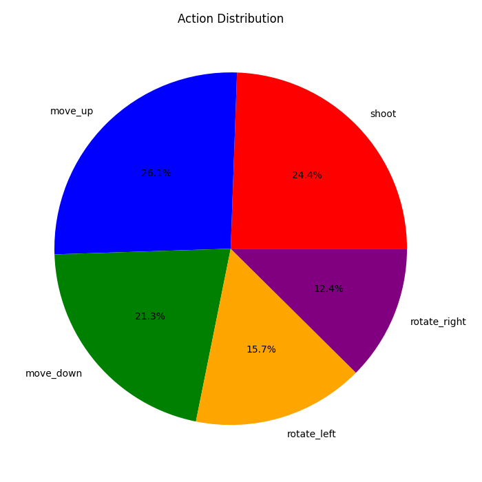

# Shooters

A neuroevolution experiment in C++. A population of agents ("shooters") controlled by
small feedforward neural networks learn to win one-on-one duels in a 2D arena. The
networks are not trained by gradient descent; their weights are optimized by a genetic
algorithm across successive generations. Per-generation fitness statistics are written to
CSV files, which a set of Python scripts renders into plots.

## Overview

Each shooter is a fixed-topology neural network. On every simulation step a shooter
observes its opponent, produces one discrete action, and the arena state is updated. At
the end of a generation every shooter is assigned a fitness value based on how well it
performed in its duel. The next generation is produced from the current one through
elitism, tournament selection, and mutation. There is no backpropagation and no explicit
training signal beyond the fitness function.

The simulation runs headless in the terminal. There is currently no graphical rendering of
the duels; results are inspected through the exported CSV logs.

## Environment and agent

- **Arena.** Square 2D field, `MAX_DIST = 800` units per side.
- **Duel.** Shooters are evaluated in fixed pairs. Each pair runs for up to `dt` steps, or
  until one shooter registers a kill.
- **State.** Each shooter has a position, a heading angle, `health = 3`, and a `score`.
- **Actions (5).** `shoot`, `moveUp`, `moveDown`, `rotateLeft`, `rotateRight`. Rotation is
  in steps of 2 degrees; translation is one unit per step.
- **Shooting.** A shot is resolved geometrically (hitscan). The opponent is projected onto
  the shooter's aim direction; if the opponent is in front and its perpendicular distance
  to the aim line is smaller than the hit radius, the shot connects, the opponent loses one
  health, and the shooter's score increases. A shooter that reaches score 3 or reduces the
  opponent to zero health is marked as having killed its opponent.

### Network

Fixed topology, defined in [`network.h`](network.h):

```
input (4) -> hidden (8, tanh) -> hidden (6, tanh) -> output (5, softmax)
```

- **Inputs (4).** Normalized distance to the enemy, relative angle to the enemy's bullet,
  normalized distance to the enemy's bullet, and relative angle to the enemy. Distances are
  divided by `MAX_DIST`; angles are normalized to the range [-1, 1].
- **Output (5).** A softmax over the five actions. The action is chosen by argmax
  (greedy), not sampled.
- **Parameters.** 110 weights (32 + 48 + 30) and 19 biases (8 + 6 + 5), for 129 values per
  network. Weights are initialized uniformly in [-0.1, 0.1].

## Genetic algorithm

Implemented in [`colony.h`](colony.h).

- **Population.** `COLONY_SIZE = 500` pairs are created, so the colony holds 1000 shooters
  (each pair is an independent duel).
- **Fitness** (see `Shooter::fitness` in [`shooter.h`](shooter.h)) rewards hits dealt and
  accuracy, adds a bonus for a kill, and penalizes hits taken, misses, and dying. The value
  is offset by a constant and clamped at zero.
- **Selection.** The default reproduction path is `tournamentSelectionResample(k)`:
  1. The top fraction of the colony is copied unchanged into the next generation
     (elitism, currently 10 percent via `elitisSelection(10)`).
  2. The remaining slots are filled by tournament selection of size `k`: `k` candidates are
     drawn at random and the fittest is copied, then mutated.
  3. Surviving shooters are re-paired into new duels.
  A fitness-proportional alternative (`resample` with `assignWeights`/`selectByWeight`) is
  also present but not used by default.
- **Mutation.** With probability `mutation_rate` (default 0.1) per parameter, a value is
  perturbed by a uniform offset in [-0.5, 0.5].

## Outputs

Written by `runSimulationTerminal`:

- **`fitness.csv`** — one row per generation:
  `best, average, worst, median, q1, q3, std_dev`.
- **`actions_count.csv`** — total action counts across the run, in the order
  `shoot, move_up, move_down, rotate_left, rotate_right`.
- **`weights.csv`** — a checkpoint of the whole colony. The first two lines are the colony
  size and the cumulative generation count; each subsequent line is one shooter's flattened
  weights and biases. On startup the colony is reloaded from this file if the stored colony
  size matches `COLONY_SIZE`, which lets runs be resumed.

## Building and running

The project targets Windows and Visual Studio (the repository includes a `.sln` and
`.vcxproj`, though these are git-ignored). It depends on the Windows multimedia library
(`winmm`, used to play a sound at the end of a run via `PlaySound`), so it is not portable
as written.

1. Open `shooters.sln` in Visual Studio and build (x64).
2. Run the resulting executable. [`main.cpp`](main.cpp) calls
   `colony.runSimulationTerminal(generations, dt)`; adjust the arguments there to change the
   number of generations and the per-duel step budget.

Note: several file paths are currently hardcoded to a specific machine (see Limitations).

### Plotting

Two Python scripts read the CSV logs and produce plots with `pandas` and `matplotlib`:

- [`simple_plots.py`](simple_plots.py) — best / average / worst fitness curves and an action
  distribution pie chart.
- [`plot_fitness.py`](plot_fitness.py) — the above plus median, quartile, and standard
  deviation panels.

```bash
pip install pandas matplotlib
python simple_plots.py
```

## Results

The `results/` directory contains representative plots produced from the CSV logs of past
runs. They illustrate the training dynamics and the behavior the population converges to;
exact values depend on the fitness function and hyperparameters used for each run, which
changed across experiments.

### Learning curve



Best, average, and worst fitness over 2000 generations. Best fitness saturates within the
first few generations, while average fitness rises gradually from negative values to a
higher plateau as the policy spreads through the population. Worst fitness stays low
throughout, which is expected: mutation continually produces poorly performing offspring.

### Population statistics



A more detailed view over 200 generations: best and third quartile, average with ±1σ and
±2σ bands and the median, population standard deviation (a proxy for genetic diversity),
and average versus median. Note that diversity grows over time rather than collapsing,
and that the average drifts above the median, indicating a right-skewed fitness
distribution (a minority of high performers).

### Emergent policy




Distribution of chosen actions across a whole run. Under a fitness function that strongly
rewards hits, the population converges to shooting almost every step (left, shoot ~85%).
Under different reward shaping the population retains a more balanced mix of moving,
rotating, and shooting (right). This is the clearest example of the fitness function
directly shaping emergent behavior.

## File layout

| File | Purpose |
| --- | --- |
| `main.cpp` | Entry point; configures and starts a run. |
| `network.h` | Feedforward network: forward pass, activations, weight I/O. |
| `shooter.h` | Agent: sensing, action control, fitness, mutation. |
| `colony.h` | Population, selection/mutation, simulation loop, CSV I/O. |
| `plot_fitness.py`, `simple_plots.py` | Plotting of the exported statistics. |
| `results/` | Representative plots from past runs. |

## Limitations

- File paths in `colony.h`, `plot_fitness.py`, and `simple_plots.py` are hardcoded to an
  absolute local path and must be edited to run elsewhere.
- Windows-only because of the `winmm` dependency.
- The duels are not rendered; behavior can only be inferred from the aggregate statistics.
- Network topology and most hyperparameters are compile-time constants.
